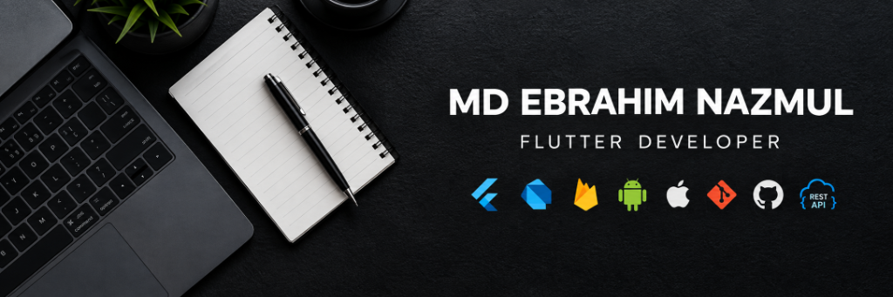

<div align="center">
  
</div>

<br/>

<div align="center">

### 📱 Flutter Developer · Building Production Mobile Apps End-to-End
**Cross-Platform (Android & iOS) · Scalable Architecture · Store Release & Compliance**

<p align="center">
  
  
  
  
</p>

<p align="center">
  <a href="https://github.com/parentroots"></a>
  <a href="#"></a>
  <a href="mailto:"></a>
</p>

</div>

---

## 👨‍💻 About Me

I'm a **Flutter Developer** at **Sparktech Agency**, Dhaka. I specialize in taking cross-platform mobile apps from raw concept to full production release on the **Google Play Store** and **Apple App Store** — including strict store policy compliance, in-app purchases, and rejection resolution. 

With a strong foundation in native Android (Java) and an eye for pixel-perfect UI, I focus on clean code architecture, responsive state management, and real-time interactive experiences.

```text
🔭 Currently Building    Production mobile apps across diverse client & enterprise domains
🌱 Currently Exploring   Riverpod architecture & advanced performance profiling
🛠  Core Daily Stack     Flutter · Dart · GetX · Firebase · REST APIs · Socket.IO · Maps
📦 Shipped To            Google Play Store & Apple App Store (Full lifecycle & compliance)
⚡ Philosophy            "Pixel-perfect UI meets bulletproof architectural foundation"
```

---

## 🛠 Tech Stack & Architecture

<table>
<tr>
<td valign="top" width="50%">

### 💻 Core & Frameworks
<p>
  
  
  
</p>

### ⚙️ State Management
<p>
  
  
</p>

</td>
<td valign="top" width="50%">

### 🌐 Real-Time & Backend
<p>
  
  
  
</p>

### 💳 Payments, Maps & Tools
<p>
  
  
  
</p>

</td>
</tr>
</table>

### 🏗 Architecture Pattern
```text
UI (Views & Custom Widgets) ◄──► GetX Controller / Cubit ◄──► Repository Layer ◄──► ApiClient (Dio) / WebSockets ◄──► Models
```
* **Folder Architecture**: Feature-first modular structure (`lib/modules/<feature_name>/` or `lib/screens/<feature_name>/`).
* **Design System**: Strict reusable custom components library (`CommonText`, `CommonButton`, `CommonTextField`, `CommonAppBar`, `CommonScaffold`, `CommonTopBar`).

---

## 🚀 Featured Projects & Case Studies

Here is a curated showcase of production-ready mobile apps I have engineered:

<table>

<!-- Project 1: Permawell Health Care -->
<tr>
<td>

### 🏥 Permawell Health Care — Doctor Appointment & Telehealth Platform
> **Type:** Production Client App &nbsp;|&nbsp; **Target:** Android & iOS &nbsp;|&nbsp; **Role:** Lead Mobile Developer

**📖 Overview:**  
A comprehensive healthcare consultation app that eliminates phone call and walk-in friction by connecting patients directly with licensed doctors for automated booking, secure payments, and telehealth communication.

**✨ Key Modules & Features:**
* **Role-Based Authentication:** Dual registration and onboarding workflows tailored for **Doctors** (verification, schedule setup) and **Patients** (health history, profile).
* **Appointment Engine:** Real-time doctor slot availability, instant booking, rescheduling, and cancellation with dynamic status tracking.
* **Consultation Payments:** Secure in-app checkout integration for appointment fees prior to confirmation.
* **Real-time Communication:** Built-in messaging channel for patient-doctor pre-consultation inquiries.

**🛠 Tech Stack:**  
`Flutter` `Dart` `GetX` `Firebase Auth & Storage` `REST API (Dio)` `Payment Gateway`

</td>
</tr>

<!-- Project 2: MileSquad -->
<tr>
<td>

### 📦 MileSquad — On-Demand Parcel Delivery Ecosystem (Dual Apps)
> **Type:** Production Client Ecosystem &nbsp;|&nbsp; **Architecture:** 2 Dedicated Apps (Customer & Rider) &nbsp;|&nbsp; **Role:** Mobile Developer

**📖 Overview:**  
A complete two-sided logistics platform designed to streamline same-day parcel deliveries. Consists of a **Customer App** for order creation and a **Rider App** for request acceptance and real-time transit management.

**✨ Key Modules & Features:**
* **Customer App (Order Lifecycle):** Multi-stop pickup/drop location picker, parcel dimension selection, fare estimation, and instant dispatch request.
* **Rider App (Dispatch & Fulfillment):** Real-time order dispatch notifications, accept/reject matching algorithm, and route navigation.
* **Live GPS Tracking (Socket.IO):** Continuous bi-directional coordinate streaming over WebSockets, allowing customers to watch delivery progression on Google Maps in real-time.
* **In-App Rider Chat:** Direct socket-based communication between sender and delivery partner with instant notifications.

**🛠 Tech Stack:**  
`Flutter` `GetX` `Socket.IO` `Google Maps SDK` `Geolocator` `Firebase FCM` `REST API`

</td>
</tr>

<!-- Project 3: Panama Legal -->
<tr>
<td>

### ⚖️ Panama Legal — Digital Legal Consultation & Law Library
> **Type:** Production Legal Tech App &nbsp;|&nbsp; **Target:** Android & iOS &nbsp;|&nbsp; **Role:** Mobile Developer

**📖 Overview:**  
A digital gateway connecting citizens with legal experts, providing instant legal guidance through automated triage chatbots, lawyer consultations, and a searchable law database.

**✨ Key Modules & Features:**
* **Real-Time Legal Chat (Socket.IO):** Upgraded chat pipeline from REST polling to bidirectional WebSockets, supporting multipart file sharing (case documents, images, PDFs).
* **Automated Triage Chatbot:** Recursive interactive question engine that categorizes client legal dilemmas and routes them to appropriate specialists.
* **Law Library & Document Viewer:** Integrated high-performance searchable PDF viewer (Syncfusion) with paginated legal codes, offline caching, and bookmarking.
* **Security & Compliance:** Token-based secure session handling, dynamic legal disclaimer agreements, and account deletion compliance.

**🛠 Tech Stack:**  
`Flutter` `Dart` `GetX` `Socket.IO` `Syncfusion PDF Viewer` `Dio HTTP Client`

</td>
</tr>

<!-- Project 4: Giolee78 -->
<tr>
<td>

### 📍 Giolee78 (Just Clicker) — Proximity Social Discovery & Monetization
> **Type:** Live on Stores (Client Listing) &nbsp;|&nbsp; **Target:** Google Play & Apple App Store &nbsp;|&nbsp; **Role:** App Engineer & Store Compliance

**📖 Overview:**  
A location-aware social discovery network enabling nearby users to connect, interact, and engage, backed by monetization via ad-supported screens and digital subscriptions.

**✨ Key Modules & Features:**
* **Store Compliance & Rejection Handling:** Successfully resolved strict App Store rejections (UGC moderation guidelines, background location policies, iPad layout constraints) and Google Play requirements (AD_ID, account deletion URL, CSAE).
* **Monetization (In-App Purchases & Stripe):** Engineered seamless native Apple/Google In-App Purchases (IAP) alongside Stripe checkout for premium memberships.
* **FCM Notification Engine:** Solved complex background/terminated app lifecycle notification routing so deep links trigger correct user screens accurately.
* **Authentication Security:** Resolved Google Sign-In SHA-1 / `DEVELOPER_ERROR` credential conflicts across release keystores.

**🛠 Tech Stack:**  
`Flutter` `GetX` `Firebase Cloud Messaging (FCM)` `In-App Purchases (IAP)` `Stripe` `Google Play Console` `Apple App Store Connect`

</td>
</tr>

<!-- Project 5: Brain Denner -->
<tr>
<td>

### 🍔 Brain Denner (Fastfood Buddy) — Smart Nutrition & Meal Tracker
> **Type:** Production Client App &nbsp;|&nbsp; **Target:** Android & iOS &nbsp;|&nbsp; **Role:** Mobile Developer

**📖 Overview:**  
A lifestyle companion app that tracks meals, restaurant dining habits, and nutritional breakdowns, giving users personalized health insights and dietary recommendations.

**✨ Key Modules & Features:**
* **Restaurant Discovery & History:** Dynamic restaurant directory with paginated user dining log and filtering.
* **Buddy Insights API:** Connected AI/analytic recommendation endpoints to calculate personalized nutrition tips based on user eating patterns.
* **State Management & Caching Fixes:** Resolved critical controller lifecycle and data persistence bugs across navigation stacks (`BeforeYouEatScreen`).

**🛠 Tech Stack:**  
`Flutter` `Dart` `GetX` `Dio REST API` `Cached Network Image` `Custom UI Widgets`

</td>
</tr>

</table>

---

## 📬 Let's Connect & Build Together

I'm actively open to **Flutter Developer roles (Full-time / Remote)** and exciting **Freelance mobile projects**. Let's talk about your next app!

<div align="center">
  <a href="#"></a>
  &nbsp;&nbsp;
  <a href="mailto:"></a>
  &nbsp;&nbsp;
  <a href="https://github.com/parentroots"></a>

  <br/><br/>
  <code><b>💡 "Eat → Code → Sleep → Repeat" 🚀</b></code>
</div>
