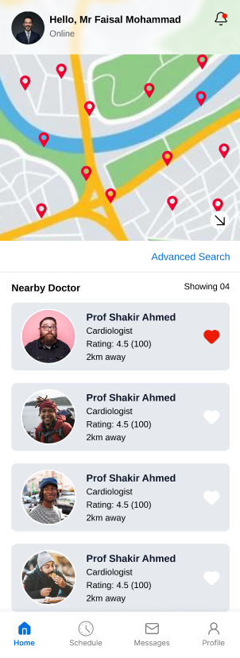
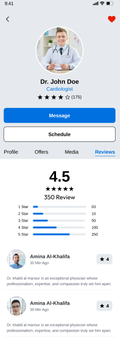
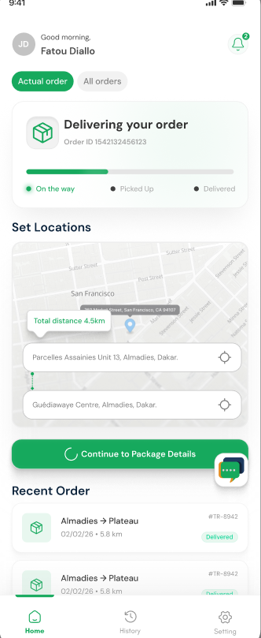
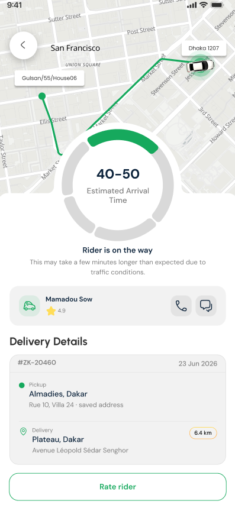
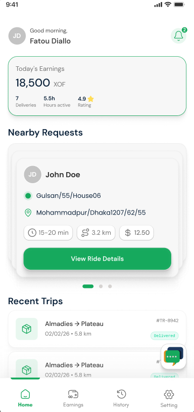

<div align="center">

# MD EBRAHIM NAZMUL

### Flutter Developer · Building production mobile apps end-to-end, from architecture to App Store release


<a href="#"></a>
<a href="#"></a>
<a href="https://github.com/parentroots"></a>

</div>

<br/>

## About Me

I'm a Flutter Developer at **Betopia Limited**, Dhaka — I build cross-platform mobile apps from scratch and take them all the way through to **Play Store** and **App Store** release, including compliance and rejection handling. I started in native Android with Java before moving fully into Flutter.

```
🔭 Currently building     mobile applications across multiple client & personal projects
🌱 Currently learning     Riverpod (migrating architectural thinking from GetX)
🛠  Daily stack            Flutter · Dart · GetX · Firebase · REST APIs · Socket.IO
📦 Shipped through        Google Play Console & Apple App Store, incl. compliance/rejections
⚡ Fun fact                I'll spend an hour fixing one pixel of UI misalignment
```

<br/>

## Tech Stack

<table>
<tr>
<td valign="top" width="50%">

**Language & Framework**


**State Management**


</td>
<td valign="top" width="50%">

**Backend & Realtime**


**Payments & Tools**


</td>
</tr>
</table>

**Architecture I follow on every project:**
`Model → ApiClient (Dio) → Repository → GetX Controller → UI`
Feature-based folder structure (`screens/feature_name/`) with a reusable component library — `CommonText`, `CommonButton`, `CommonTextField`, `CommonAppBar`, `CommonScaffold`, `CommonTopBar`.

<br/>

## Featured Projects

<table>
<tr>
<td width="60">🏥</td>
<td>

### Permawell Health Care — Doctor Booking App
**Status:** `Private / Client Project`

Connects patients with doctors for appointment booking, removing the friction of calls or walk-ins.

| What I built | |
|---|---|
| Auth | Dual sign-up/login flows for **Doctor** and **Patient** roles |
| Booking | Appointment **create & cancel** flow |
| Payments | In-app **payment** integration for consultations |
| Communication | Real-time **messaging** between doctor and patient |

<p align="left">
  
  
</p>

`Flutter` `GetX` `Firebase` `REST API` `Payment Gateway`

</td>
</tr>

<tr>
<td width="60">📦</td>
<td>

### MileSquad — Parcel Delivery App
**Status:** `Private / Client Project`

A two-sided parcel delivery platform, shipped as **separate Customer and Rider apps**, connecting people who need to send parcels with riders who deliver them.

| What I built | |
|---|---|
| Customer app | Parcel **creation** flow — pickup/drop details, request submission |
| Rider app | **Accept/assign** flow for incoming delivery requests |
| Live tracking | **Real-time map tracking** over sockets for both customer and rider |
| Communication | In-app **messaging** between customer and rider |

<br/>

<p align="left">
  
  
  
</p>

<br/>

`Flutter` `GetX` `Socket.IO` `Google Maps` `Firebase`

</td>
</tr>

<tr>
<td width="60">⚖️</td>
<td>

### Panama Legal — Multi-Role Legal Services Platform
**Status:** `Private / Client Project`

Bridges citizens and lawyers on one platform for legal consultation, document access, and case communication.

| What I built | |
|---|---|
| Chat | Migrated citizen–lawyer chat from REST to **Socket.IO**, added multipart file attachments |
| Chatbot | Recursive sub-question navigation for legal query triage |
| Documents | Searchable **PDF viewer** (Syncfusion) + paginated **law library** |
| Polish | Profile, logout, and terms screens refined; primary resume project with iteratively tuned write-ups |

`Flutter` `GetX` `Socket.IO` `Syncfusion PDF` `REST API`

</td>
</tr>

<tr>
<td width="60">📍</td>
<td>

### Giolee78 (Just Clicker) — Social / Location-Based App
**Status:** `Private / Client Project` · Live on Play Store & App Store (client-owned listing)

A location-aware social app connecting nearby users, with in-app purchases and ad-supported screens.

| What I built | |
|---|---|
| Notifications | Fixed **FCM navigation** bugs across all app lifecycle states |
| Payments | Built **Stripe WebView** flow, later migrated to **native IAP** for App Store compliance |
| Auth | Resolved **Google Sign-In SHA-1 / DEVELOPER_ERROR** issues |
| Store compliance | Play Console (AD_ID, delete-account URL, CSAE policy, content rating) + fixed multiple App Store rejections (location permissions, IAP, UGC moderation, iPad bugs) |
| UI | Redesigned `ViewAdsScreen` and `DashboardScreen` |

`Flutter` `GetX` `Firebase Cloud Messaging` `Stripe` `In-App Purchases`

</td>
</tr>

<tr>
<td width="60">🍔</td>
<td>

### Brain Denner (Fastfood Buddy) — Food & Health Tracking App
**Status:** `Private / Client Project`

Helps users track meals, restaurant choices, and nutrition history in one place.

| What I built | |
|---|---|
| Discovery | Restaurant details screen + paginated **history list** |
| Bug fix | Fixed critical `BeforeYouEatScreen` navigation/data bug from GetX controller caching |
| Insights | Integrated **Buddy Insights API** for personalized recommendations |

`Flutter` `GetX` `REST API`

</td>
</tr>
</table>

<br/>

## Let's Connect

Open to **Junior/Mid Flutter Developer** roles and freelance mobile projects.

<div align="center">
<a href="#"></a>
<a href="#"></a>

<h3>🔥 "Eat → Code → Sleep → Repeat" 🔥</h3>
</div>
